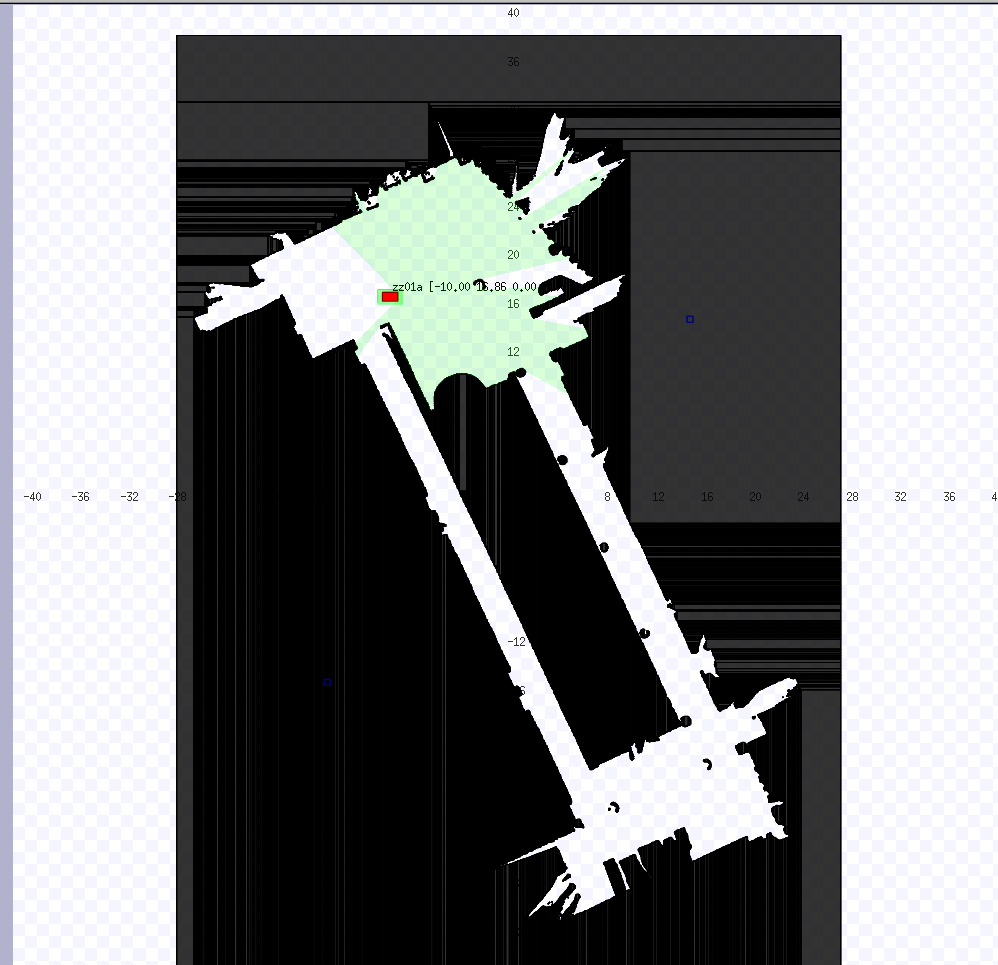
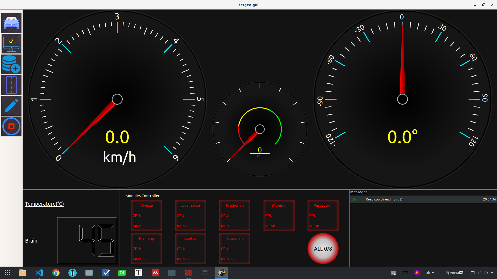
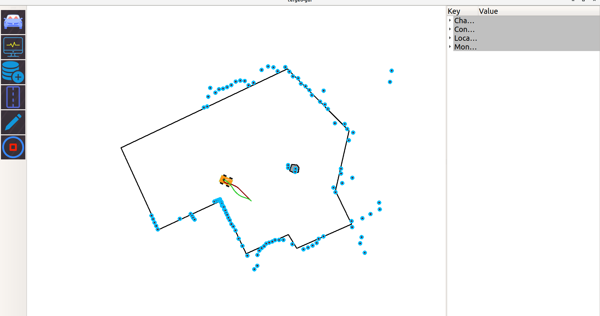

### Install Dependances
- ros-melodic-desktop-full, please install it from the guidance of this website: 

  []: http://wiki.ros.org/ROS/Installation

  .

- ```sudo apt install -y libceres-dev ros-melodic-libg2o ros-melodic-navigation libcgal-dev libcgal-qt5-dev libompl-dev```

### Build and Install CNCR
#### build simulator
- ```./build_stage.sh```
- ```./build.sh```
#### install basic libraries
- ```sudo cp -r tergeo /tergeo```
- ```sudo chmod -R 777 /tergeo```

### Run CNCR Demo

Fisrtly, launch the carlike robot simulator by 

- ```roslaunch stage_simulator simulator.launch robot_name:=zz01a data_path:=/tergeo/map_data/areas map:=map.png tfw:=map.tfw```

You will see an application like below:



Then, go to the CNCR enviroment.

- ```cd /tergeo/bash```

Open four terminal, and run below commands:

- ```./start_monitor.sh```
- ```./start_tergeo_gui.sh```
- ```./start_planning.sh```
- ```./start_control.sh```

You will see an application GUI like this:





Click the second button on the left and press 'F5', the robot will be running on your screen:

